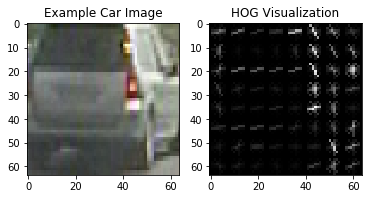
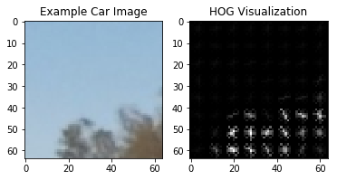
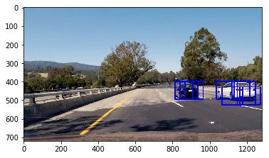
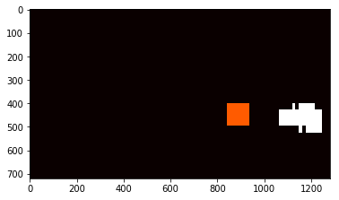
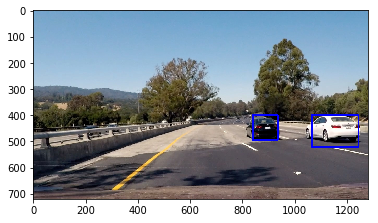

**Vehicle Detection Project**

[video1]: ./out.mp4
### Overview

Detect vehicles using SVM classifier with sliding windows. This project is part of the [Udacity Self-Driving Car Nanodegree](https://www.udacity.com/drive), and much of the code is leveraged from the lecture notes.

The overall pipeline is the following:

* Perform a Histogram of Oriented Gradients (HOG) feature extraction on a labeled training set of images
* Train a linear SVM classifier on normalized HOG features
* Implement a sliding-window technique and use trained classifier to search for vehicles in images
* Run the above steps on a video stream and create a heat map of recurring detections frame by frame to remove duplicates and reject outliers
* Estimate a bounding box for vehicles detected.

### Histogram of Oriented Gradients (HOG)
I used scikit image hog method to extract the HOG features. 

To extract the optimal HOG features, I experimented with different color spaces, pixel per cell and cell per block. I visualized the resulted HOG features and decided the parameters and color spaces.

The paramters are settled as the following:

* Color space: RGB
* Channel: (all)
* Orientations: 9
* Pixels per cell: 8
* Cells per block: 2

Below is a visualization of the HOG features on the example vehicle and non-vehicle images.

Vehicle HOG:

Non-vehicle HOG:

I trained a linear SVM using the HOG features and spatial features. I ended up getting rid of histogram features as I did not find them useful because they did not improve model accuracy. HOG plus spatial feature already give me 99.61% test accuracy, while HOG only gives around 98% test accuracy.

### Train a linear SVM classifier
I trained the SVM with the HOG features, which is implemented in `train.py`. `extract_features` in `feature.py` extracts HOG feature per image. I intentionally make non--vehicle to vehicles ratio 3:1 because I originally got too many false positives. Finally I normalized the features by scikit-learn's StandardScaler.

I split the data into 95% training examples and 5% test examples. The model is saved as model.p after training is done. and saved the final trained model to 'model.p'. 

### Sliding window search
The sliding window search code is to detect areas in the image/video where a vehicle is likely present. A window size of 96x96 pixels worked well for the scale of vehicles present in the project video, so I only used this window size.

I limited the search area to be the bottom half of the images because there is no car in the sky. `x_start_stop=(0, 1280), y_start_stop=(400, 656)`. This reduces false positives and also reduces searching time. 

I chose an overlap percentage of 0.7 which gave me reliable detections with multiple detected bounding boxes on vehicles, This also helps to reject potential false positives.

Below is an example of the window search on an image (blue boxes indicate a vehicle detection in that window):

Note there are lots of redundant boxes around car.

### Final bounding box prediction
There are lots of boxes around the vehicle so we want to post-process the bounding boxes to remove redundant boxes. I counted the occurance for each predicted box, and then set a threshold 33, so the region with the count higher than the threhold will be kept, and the rest will be discarded. This is called heatmap method.

I use scikit-learn's `label()` function to draw the final bounding boxes based on our thresholded heat map. T

The above illustrations were based on a static image. However, in a video stream, we can take advantage of the temporal correlation between video frames. I kept track of a cumulative heat map over the past 30 frames in a video, and threshold the cumulative heatmap. The cumulative heatmap is enabled by a queue of "heatmap windows", and the implementation is in the class `HMWindows()` in the file 'HMWindows.py'.

For the cumulative heat map, I chose a window history of 30 frames, and a heat map threshold of 30. I found these settings give a good rejection rate for false positives, while not accumulating bounding boxes over too long a time period such that the detections lag behind too much.

### Final video output
[Here](https://youtu.be/VgFoLBVdViM) is the final video output on Youtube. The same video is 'out.mp4' in this repo. The original video is 'project_video.mp4'.

### Discussion
The main challenge for this project was parameter tuning, mostly to reduce the number of false positives in the video. Though the test accuracy is > 99%, it does not mean it does not almost perfect in the video. There are few cars in the video, and the video was recorded in day time. So many cases are not revealved by the video. We need more test cases to improve the detector.

Another improvement that can be done is using CNN deep learning approach and YOLO. CNN has been proved very successful in computer vision. I will try this approach in the future.

### Reference
https://github.com/georgesung/vehicle_detection_hog_svm
https://chatbotslife.com/vehicle-detection-and-tracking-using-computer-vision-baea4df65906
http://www.learnopencv.com/histogram-of-oriented-gradients/
